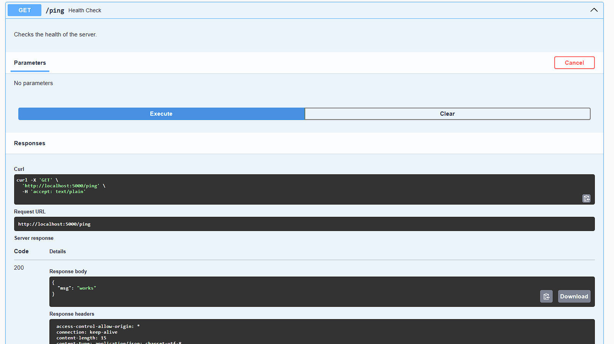
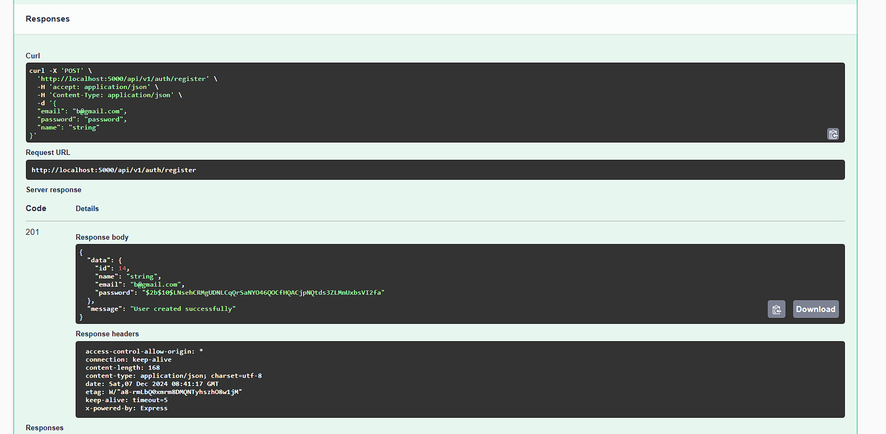

# WorkIndia Backend Assignment
#### Starting Time : 3:00 PM
#### Deadline : <24 hours

  

<details>

<summary><strong>Backend Assignment Details</strong></summary>

### Project: Railway Management System (IRCTC-like API)

  

#### Goals:

1.  **User Registration**: Allow users to register and create an account.

2.  **User Login**: Enable users to log in and access their accounts.

3.  **Admin Access**: Admin can add new trains and update seat availability.

4.  **Seat Availability**: Allow users to check seat availability for a given train between two stations.

5.  **Booking Seats**: Users can book seats on available trains.

6.  **Booking Details**: Users can view their booking details.

  

#### Requirements:

1.  **Tech Stack**:
-  Web Server: NodeJS, ExpressJS and TypeScript
- Database: PostgreSQL for storing train, user, and booking data

  

2.  **Endpoints**:

-  **POST /api/v1/register**: Register a user with a name, unique email, and password.

-  **POST /api/v1/login**: Log in a user and return an authentication token.

-  **POST /api/v1 /admin/addTrain**: Admin can add a new train with source, destination, and seat count (protected by an API key).

-  **GET /api/v1/booking/getSeatAvailability**: Fetch available trains between a source and destination with seat availability.

-  **POST /api/v1/booking/bookSeat**: Book a seat on a specified train (requires Authorization Token).

-  **GET /api/v1/booking/{booking_id}**: Fetch specific booking details by booking ID (requires Authorization Token).

  

3.  **Role-Based Access**:

-  **Admin**: Can add trains, update seat counts, etc.

-  **User**: Can check availability, book seats, and view bookings.

  

4.  **Concurrency**: Handle race conditions when multiple users attempt to book the same seat simultaneously.

  

5.  **Security**:

-  **API Key**: Protect admin endpoints with an API key.

-  **Authorization Token**: Use JWT or session tokens for user login and for accessing booking-related endpoints.

  

#### Bonus Points:

- Implement a lock mechanism to handle concurrency and prevent multiple users from booking the same seat simultaneously.
- Add automated tests to ensure that API endpoints work as expected.


  

## Tech Stack

  

-  **Language**: Node 20.11.0, TypeScript 5

-  **Framework**: Express.js

-  **Database**: Postgres

  

## Architecture Overview

  

The project follows a modular architecture, with different components responsible for specific tasks. The main components are:

  

1.  **API Routes**: Handles the API endpoints for fetching videos and health checks.

3.  **Database**: Manages the database connection and creation of tables.

4.  **Models**: Defines the database models for storing video data and fetch history.

5.  **Utils**: Includes utility functions for configuration, task scheduling, and more.

  

## Design Choices

  

1.  **Express**: It is a fast and minimal web framework for Node.js, designed for building RESTful APIs. It provides a lightweight structure that helps in creating scalable and performant applications with ease. Express allows for middleware integration, routing, and handling requests in a straightforward manner, making it ideal for this project where we need to manage user and admin roles, handle concurrency, and provide APIs for train seat availability and bookings.

2.  **Postgres**: **PostgreSQL** is a powerful, open-source relational database management system (RDBMS) that supports complex queries, transactions, and data integrity through ACID properties (Atomicity, Consistency, Isolation, Durability). It is chosen for this project because it is highly scalable, robust, and supports advanced features like indexing, foreign keys, and JOINs, which are essential for handling structured data such as user information, train data, and bookings. PostgreSQL is well-suited for scenarios with large-scale data handling and concurrency, ensuring high performance and reliability.

  

Moreover, it will perform faster than non-relational databases, as most relational databases and some NoSQL databases (e.g., MongoDB) use B-trees, which are better for reads than writes. SQLite was chosen as it is file-based and eases deployment and development.

  

## Getting Started

  

To run the project locally, follow these steps:

  

1. *Clone the repository*:
`git  clone  https://github.com/ShashankGupta10/workindia-assignment.git`

  

2. Create a `.env` file

- Rename `.example.env` to `.env`.

-  `DATABASE_URL` (Database connection string)

-  `SALT` (To make passwords hashing even more secure)

-  `JWT_SECRET` 

-  `ADMIN_API_KEY` (API Key for the ADMIN to access the protected routes) 

  

## Running the application

  

**Setup**

  

1.  **Prerequisites:**

- Node 20.11.0+

- npm (package installer)

2.  **Clone the repository:**

`git clone https://github.com/ShashankGupta10/workindia-assignment`

3.  **Install dependencies:**

`npm install`

**Local Setup**

4.  **Run the application:**
`npm start`

  

The API will be accessible at `http://localhost:5000/swagger`.

  

With these instructions, users will be guided on how to set up and run the application within a virtual environment.

### API Endpoints
#### Health Check

  

-  **Endpoint**: `GET /ping`

-  **Purpose**: This endpoint serves as a simple health check for the API. It returns a "{ "msg": "works" }!" message, indicating that the API is operational.

  

### Swagger UI Integration

  

#### `/docs`

  

Swagger UI provides an interactive documentation interface for exploring the API endpoints. It offers a user-friendly way to understand the available endpoints, their parameters, and expected responses.

#### Ping (HealthCheck)

  

-  **Screenshot 1**: Shows the endpoint for health check (`GET /ping`) in Swagger UI.



#### Register User


-  **Screenshot 2**: Illustrates the working of the register user endpoint



  

#### Login User

  

-  **Screenshot 3**: Illustrates the working of the login user endpoint


#### Add Train

-  **Screenshot 4**: Shows an example of a response when the admin adds a Train.


#### Get Seat Availability

-  **Screenshot 5**: Shows an example of a response when the user checks the seat availability between 2 stations.


#### Book Seat

-  **Screenshot 6**: Shows an example of a response when the user tries to book a seat in the train.


#### Get Booking Details

-  **Screenshot 7**: Shows an example of a response when the user tries to get their booking details.


  

## Deployed Version

  

A live version of the application is available at [https://workindia-assignment.nymbus.xyz](https://workindia-assignment.nymbus.xyz).


Upon accessing the deployed version, please note the following:

1.  **Health Check**: To ensure that the server is operational, you can access the `/ping` endpoint [here](https://workindia-assignment.nymbus.xyz/ping). A successful response indicates that the server is healthy and operational.

 
  

Please note that the deployed version might experience frequent downtime or performance issues due to resource limitations in the free tier. Therefore, it is **not recommeneded** to explore the API endpoints and functionality of the project without setting up the application locally.

  

## Database Models

  


### The `src/prisma/schema.prisma` file defines the following database models:

### 1. **User**:

-   **id** (Int, @id, @default(autoincrement())): Unique identifier for each user record.
-   **name** (String): The name of the user.
-   **email** (String, @unique): The unique email of the user.
-   **password** (String): The hashed password of the user.
-   **bookings** (Booking[]): A one-to-many relationship to the `Booking` table, representing the user's bookings.

### 2. **Train**:

-   **id** (Int, @id, @default(autoincrement())): Unique identifier for each train record.
-   **name** (String): The name of the train.
-   **source** (String): The source station for the train.
-   **destination** (String): The destination station for the train.
-   **totalSeats** (Int): The total number of seats available on the train.
-   **availableSeats** (Int): The number of available seats on the train.
-   **bookings** (Booking[]): A one-to-many relationship to the `Booking` table, representing the bookings made for the train.

### 3. **Booking**:

-   **id** (Int, @id, @default(autoincrement())): Unique identifier for each booking record.
-   **userId** (Int): The ID of the user who made the booking (references `User.id`).
-   **trainId** (Int): The ID of the train for which the booking was made (references `Train.id`).
-   **user** (User): The user who made the booking, represented by a relation to the `User` table.
-   **train** (Train): The train for which the booking was made, represented by a relation to the `Train` table.
  

## File Structue and Breakdown

  

```

workindia-backend-assignment

├── .env
├── .env.example
├── .env.test
├── .gitignore
├── jest.config.js
├── package.json
├── README.md
├── swagger.yaml
├── tsconfig.json
├── src/
│   ├── app.ts
│   ├── controllers/
│   │   ├── admin.controller.ts
│   │   ├── auth.controller.ts
│   │   └── booking.controller.ts
│   ├── db/
│   │   └── index.ts
│   ├── interfaces/
│   │   ├── auth.ts
│   │   ├── booking.ts
│   │   └── train.ts
│   ├── middlewares/
│   │   ├── admin.middleware.ts
│   │   └── auth.middleware.ts
│   ├── prisma/
│   │   ├── migrations/
│   │   └── schema.prisma
│   ├── routes/
│   │   ├── admin.routes.ts
│   │   ├── auth.routes.ts
│   │   └── booking.routes.ts
│   └── tests/
│       ├── admin.test.ts
│       ├── auth.test.ts
│       └── booking.test.ts
  ```

1.  `app.ts`: This file sets up the Express application and includes the routes for authentication, admin, and booking. It also configures middleware and Swagger documentation.
    
2.  `admin.controller.ts`: This file contains the controller logic for admin-related operations, such as adding new trains.
    
3.  `auth.controller.ts`: This file contains the controller logic for authentication-related operations, such as user registration and login.
    
4.  `booking.controller.ts`: This file contains the controller logic for booking-related operations, such as booking seats and retrieving booking details.
    
5.  `index.ts`: This module handles the database connection using Prisma and provides the Prisma client instance.
    
6.  `auth.ts`: This file defines the Zod schemas and types for authentication-related data validation.
    
7.  `booking.ts`: This file defines the Zod schemas and types for booking-related data validation.
    
8.  `train.ts`: This file defines the Zod schemas and types for train-related data validation.
    
9.  `admin.middleware.ts`: This file contains the middleware logic for verifying the admin API key.
    
10.  `auth.middleware.ts`: This file contains the middleware logic for verifying JWT tokens for authenticated routes.
    
11.  `schema.prisma`: This file defines the Prisma schema for the database models, including User, Train, and Booking.
    
12.  `admin.routes.ts`: This file defines the routes for admin-related endpoints, protected by the admin middleware.
    
13.  `auth.routes.ts`: This file defines the routes for authentication-related endpoints, such as registration and login.
    
14.  `booking.routes.ts`: This file defines the routes for booking-related endpoints, protected by the authentication middleware.
    
15.  `admin.test.ts`: This file contains the unit tests for admin-related endpoints.
    
16.  `auth.test.ts`: This file contains the unit tests for authentication-related endpoints.
    
17.  `booking.test.ts`: This file contains the unit tests for booking-related endpoints.
    
18.  `Dockerfile`: This file contains the instructions for building the Docker image for the application.
    
19.  `jest.config.js`: This file configures Jest for running the unit tests.
    
20.  `package.json`: This file lists the project dependencies and scripts.
    
21.  `swagger.yaml`: This file contains the Swagger documentation for the API endpoints.
    
22.  `tsconfig.json`: This file configures TypeScript compiler options.
    
23.  `.env`: This file contains environment variables for the application.
    
24.  `.env.example`: This file provides an example of the required environment variables.
    
25.  `.env.test`: This file contains environment variables for the test environment.
    
26.  `.gitignore`: This file specifies files and directories to be ignored by Git.